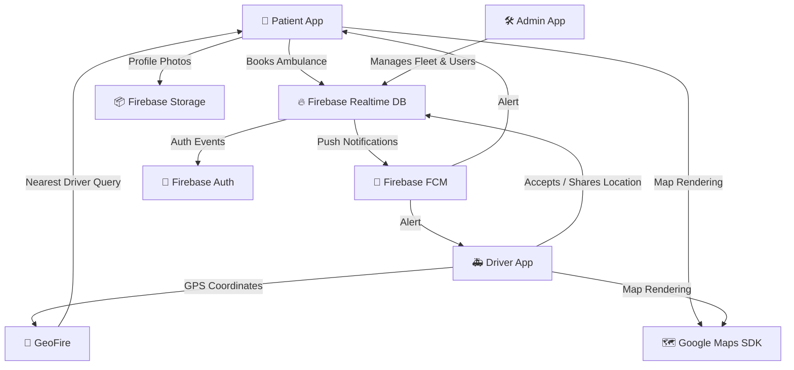

<div align="center">

<!-- Animated header banner -->


<!-- Animated typing SVG -->
<a href="https://git.io/typing-svg">
  
</a>

<br/>

<!-- Badges -->


</div>

---

## 🌟 Overview

<div align="center">

> **A full-stack Android application** that provides a real-time ambulance booking and tracking system. Designed as a Final Year Project to bridge the gap between patients in emergency situations and available ambulance drivers through a seamless, location-aware platform.

</div>

```
📱 Patient requests ambulance  ──►  🚑 Nearest driver is notified  ──►  🗺️ Live tracking begins  ──►  ✅ Patient reached
```

---

## ✨ Key Features

<div align="center">

| Feature | Description | Tech Used |
|:-------:|:------------|:---------:|
| 🔐 **Authentication** | Email/Password & Google Sign-In | Firebase Auth |
| 🗺️ **Live Tracking** | Real-time GPS tracking on map | Google Maps + GeoFire |
| 🚑 **Ambulance Booking** | One-tap emergency request | Firebase Realtime DB |
| 🔔 **Push Notifications** | Instant alerts to drivers & patients | Firebase Cloud Messaging |
| 👥 **Multi-Role System** | Separate portals for Patient, Driver & Admin | Firebase Auth + DB |
| 📸 **Profile Management** | Upload & display profile photos | Firebase Storage + Glide |
| 📡 **Background Location** | Continuous driver location updates | Foreground Service |
| 🚫 **Trip Cancellation** | Cancel trips with real-time status update | Firebase Realtime DB |
| 🏠 **Admin Dashboard** | Manage drivers, users & ambulance fleet | Firebase Realtime DB |

</div>

---

## 🏗️ Architecture & Tech Stack

<div align="center">



</div>

---

## 👥 User Roles

<div align="center">

```
┌──────────────────────────────────────────────────────────────┐
│                    🚑  AMBULANCE APP                         │
├──────────────────┬──────────────────┬────────────────────────┤
│  👤  PATIENT     │  🚗  DRIVER      │  🛠️  ADMIN             │
├──────────────────┼──────────────────┼────────────────────────┤
│ • Request ride   │ • Accept trips   │ • Manage drivers       │
│ • Track driver   │ • Share live GPS │ • View all bookings    │
│ • View ETA       │ • Go online/off  │ • Register admins      │
│ • Cancel trip    │ • Get alerted    │ • Monitor system       │
│ • Get notified   │ • View rider map │ • Oversee fleet        │
└──────────────────┴──────────────────┴────────────────────────┘
```

</div>

---

## 📦 Dependencies

```gradle
// Core Android
androidx.appcompat:appcompat:1.7.0
com.google.android.material:material:1.12.0

// 🔥 Firebase (BOM managed)
firebase-bom:33.1.0
firebase-database       // Realtime Database
firebase-auth           // Authentication
firebase-messaging      // Push Notifications (FCM)
firebase-storage        // Image Storage

// 🔐 Google Sign-In
play-services-auth:21.2.0

// 🗺️ Maps & Location
play-services-maps:19.0.0
play-services-location:21.3.0
google-maps-services:0.18.0

// 📍 Geo-querying
geofire-android:3.2.0

// 🖼️ Image Loading
glide:4.16.0

// 🌐 HTTP Client
okhttp3:4.12.0
```

---

## 🚀 Getting Started

### Prerequisites

- ✅ Android Studio **Hedgehog** or later
- ✅ Android device / emulator with **API 24+**
- ✅ Google account with Maps API key
- ✅ Firebase project set up

### Installation

```bash
# 1️⃣ Clone the repository
git clone https://github.com/Msollajr/ambulance.git

# 2️⃣ Open in Android Studio
# File → Open → select the 'ambulance' folder

# 3️⃣ Add your configuration files
# Place google-services.json in app/
# Add your Maps API key in AndroidManifest.xml

# 4️⃣ Sync Gradle and Run! 🎉
```

### Firebase Setup

```
1. Go to https://console.firebase.google.com
2. Create a new project → Add Android App
3. Download google-services.json → place in /app folder
4. Enable:  Authentication  → Email/Password + Google
            Realtime Database → Start in test mode
            Storage          → Start in test mode
            Cloud Messaging  → enabled by default
```

---

## 📱 Screens & Activities

<div align="center">

| Activity | Role | Description |
|----------|------|-------------|
| `MainActivity` | All | Login / Google Sign-In entry point |
| `Register` | Patient | Patient registration screen |
| `Register_admin` | Admin | Admin & Driver registration |
| `Home` | Patient | Request ambulance + live map view |
| `Drv_Home` | Driver | Accept trips + share live location |
| `Admin_Home` | Admin | Manage system & users |

</div>

---

## 📡 Permissions

```xml
<!-- Location Tracking -->
ACCESS_FINE_LOCATION
ACCESS_COARSE_LOCATION
ACCESS_BACKGROUND_LOCATION

<!-- Background Driver Tracking -->
FOREGROUND_SERVICE
FOREGROUND_SERVICE_LOCATION

<!-- Media & Camera -->
CAMERA
READ_MEDIA_IMAGES
READ_EXTERNAL_STORAGE

<!-- Other -->
INTERNET
POST_NOTIFICATIONS
```

---

## 🗂️ Project Structure

```
ambulance/
├── 📁 app/
│   ├── 📁 src/main/
│   │   ├── 📁 java/com/example/mysignupapp/
│   │   │   ├── 🔑 MainActivity.java               # Login / Google Sign-In
│   │   │   ├── 🏠 Home.java                       # Patient dashboard + map
│   │   │   ├── 🚗 Drv_Home.java                   # Driver dashboard
│   │   │   ├── 🛠️ Admin_Home.java                 # Admin panel
│   │   │   ├── 📝 Register.java                   # Patient sign up
│   │   │   ├── 📝 Register_admin.java             # Admin/Driver sign up
│   │   │   └── 🔔 AmbulanceMessagingService.java  # FCM handler
│   │   ├── 📁 res/                                # Layouts, drawables, values
│   │   └── 📄 AndroidManifest.xml
│   └── 📄 build.gradle
├── 📁 images/                                     # App screenshots & assets
├── 📄 build.gradle
└── 📄 README.md
```

---

## ⚠️ Security Notes

> **Warning:** Before pushing to a public repository, make sure to:
> - Remove or gitignore `google-services.json`
> - Remove the Google Maps API key from `AndroidManifest.xml`
> - Set Firebase Database rules to **not** allow public read/write in production

---

## 🎓 About This Project

<div align="center">

This application was developed as a **Final Year Project (FYP)** demonstrating:

🔬 **Research Area:** Emergency Healthcare Technology & Mobile Computing

📚 **Concepts Applied:**

`Real-Time Systems` • `Location-Based Services` • `Push Notification Architecture` • `Multi-Role Access Control` • `Cloud-Integrated Mobile Apps`

</div>

---

## 📊 GitHub Stats

<div align="center">
  
  
</div>

---

<div align="center">

<!-- Animated footer -->


**Made with ❤️ as a Final Year Project**

⭐ *If you found this project useful, consider giving it a star!* ⭐

[](https://github.com/Msollajr)

</div>
